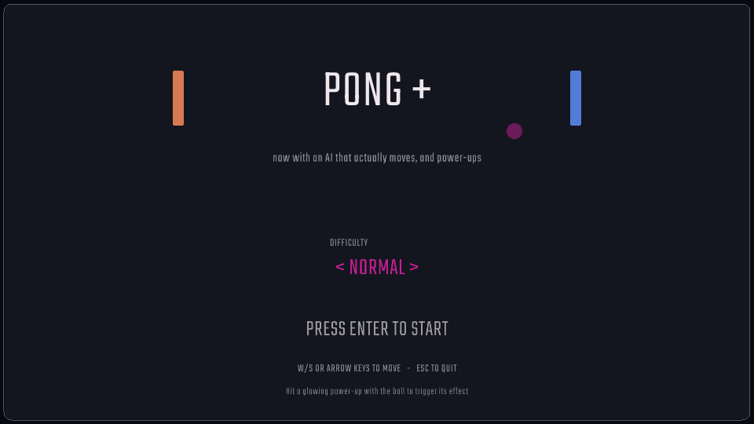

# Pong+

A rebuilt version of the original raylib Pong project: reorganized into a
clean folder structure, a real (working) AI opponent, a proper title screen,
the supplied art/font assets wired in, and a set of power-ups.



## What changed from the original project

- **Folder structure cleaned up** — sources in `src/`, assets in `assets/`,
  no stray `.dll` files or IDE workspace files committed to the project.
- **CMake build** replacing the old raylib example Makefile. It fetches and
  builds raylib automatically if it isn't already installed, so there's
  nothing to install by hand first (see *Build*, below).
- **AI opponent actually works now.** The original `AIPaddle` class had no
  `Update()` method at all and `main.cpp` never moved it — it just sat
  still. It now tracks the ball with a human-like reaction delay, a bit of
  aim error, and a capped move speed, tuned per difficulty (Easy / Normal /
  Hard, selectable from the title screen).
- **Full game loop added**: paddle-ball collisions with angle deflection
  (where the ball hits the paddle changes the bounce angle, like classic
  Pong/Arkanoid), a small speed increase each rally, scoring, a win
  condition, and a serve/pause/game-over flow — none of which existed
  before (the old version was just a bouncing ball with two static
  rectangles drawn on screen).
- **Art & font wired in** from the assets pack: paddle, ball, ball-motion
  trail, and score bar sprites, plus the Teko font used for all text.
- **Power-ups**: Grow, Shrink Rival, Speed Boost, and Slow Ball. They spawn
  periodically on the field; whichever side's shot last touched the ball
  gets the benefit when the ball passes through one, so grabbing them is a
  skill move, not luck.

## Controls

| Action              | Keys                       |
|---------------------|-----------------------------|
| Move paddle         | `W` / `S`, or arrow keys, or mouse Y |
| Change difficulty (title screen) | `←` / `→` or `A` / `D` |
| Start / rematch      | `Enter` or `Space`         |
| Pause / resume       | `P`                        |
| Back to title / quit | `Esc`                      |

## Project structure

```
pong/
├── CMakeLists.txt        # build configuration
├── LICENSE.txt
├── README.md
├── assets/
│   ├── fonts/
│   │   └── Teko-VariableFont.ttf
│   └── images/
│       ├── ball.png
│       ├── ball_motion.png
│       ├── board.png
│       ├── paddle_ai.png
│       ├── paddle_player.png
│       └── scorebar.png
└── src/
    ├── main.cpp
    ├── Game.h / Game.cpp          # state machine: title/serve/play/pause/game over
    ├── Paddle.h / Paddle.cpp      # shared paddle base (size/speed power-up state)
    ├── PlayerPaddle.h / .cpp      # keyboard/mouse control
    ├── AIPaddle.h / .cpp          # AI tracking logic
    ├── Ball.h / Ball.cpp          # physics + motion trail
    └── PowerUp.h / PowerUp.cpp    # power-up types, icons, effects
```

## Build

You need a C++17 compiler and CMake 3.15+. On Linux you'll also need the
usual X11/OpenGL development headers that raylib itself needs to build
(skip this if raylib is already installed on your system):

```bash
# Debian/Ubuntu only, first time — skip if you already have raylib installed
sudo apt install cmake libgl1-mesa-dev libx11-dev libxrandr-dev \
                  libxi-dev libxcursor-dev libxinerama-dev pkg-config
```

Then, from the project root:

```bash
cmake -S . -B build -DCMAKE_BUILD_TYPE=Release
cmake --build build -j
```

The first build will take a little while the first time — CMake downloads
and compiles raylib itself if it can't find one already on your system
(via `find_package`). After that it's cached and subsequent builds are
fast.

## Run

The executable is written to `build/bin/`:

```bash
# Linux / macOS
./build/bin/PongPlus

# Windows (from an appropriate shell, e.g. after a Visual Studio build)
build\bin\PongPlus.exe
```

Assets are located automatically — no need to `cd` into a specific folder
first, and no need to copy files around. The build also copies the
`assets/` folder next to the executable, so the `build/bin/` folder is
fully self-contained if you want to zip it up and share it with someone
who doesn't have the source.

### Windows via Visual Studio

```bash
cmake -S . -B build -G "Visual Studio 17 2022"
cmake --build build --config Release
```

The executable will be at `build\bin\Release\PongPlus.exe`.

## Notes

- First to **7 points** wins.
- The AI's difficulty can be changed on the title screen before starting a
  match — it isn't adjustable mid-game.
- Power-ups despawn after ~9 seconds if nobody hits them through, so
  there's no permanent clutter on the field.

## Credits

- Game code: this project.
- Art assets: Esoe B. Studios (`simple-ping-pong-2Dgame-assets` pack).
- Font: [Teko](https://fonts.google.com/specimen/Teko) by Indian Type
  Foundry, licensed under the SIL Open Font License.
- Built with [raylib](https://www.raylib.com/).
